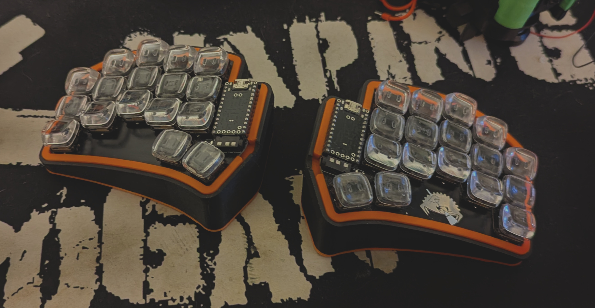
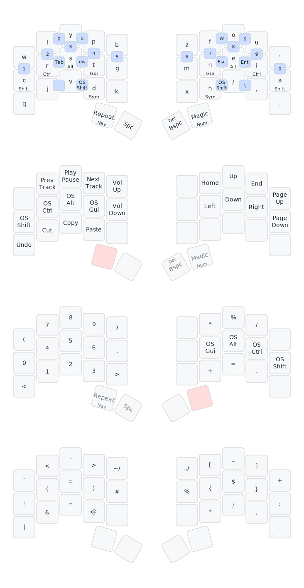

# QMK Keymaps



## Features
* **Autocorrect**
* **Combos**
* **Home Row Mods**
* **Nav, Num, Sym Layers**
* **Repeat / Magic Keys**

## My Keymap


See [**magic sturdy**](https://github.com/Ikcelaks/keyboard_layouts/blob/main/magic_sturdy/magic_sturdy.md) for usage of the magic key.

## Installation
Follow the [getting started](https://docs.qmk.fm/#/newbs_getting_started) docs to install [QMK Firmware](https://docs.qmk.fm/#/)

```sh
# Clone the keymaps
git clone https://git.sajenim.dev/jasmine/qmk_keymaps.git
    
# Merge our keymaps into qmk_firmware
rsync --recursive qmk_keymaps/keyboards/ qmk_firmware/keyboards/

# Compile the firmware
qmk compile -kb <myKeyboard> -km <myKeymap>
```

## References
* [Precondition](https://precondition.github.io/home-row-mods)
* [Pascal Getreuer](https://getreuer.info/posts/keyboards/index.html)
* [Ikcelaks](https://github.com/Ikcelaks/keyboard_layouts/tree/main)
