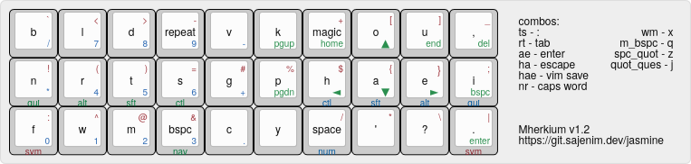
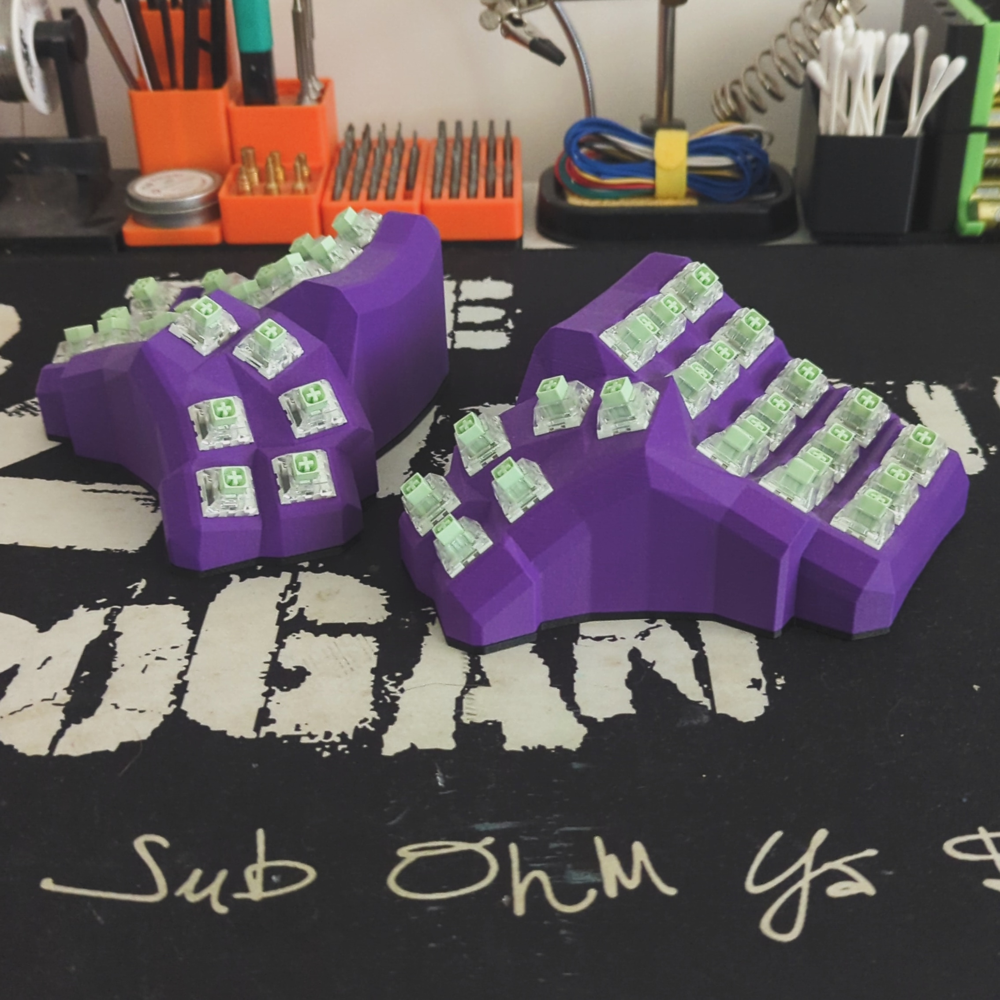

# QMK Keymaps

Personal keymaps for programmable keyboards. 

## Keyboards
- [Keychron Q4](https://www.keychron.com/products/keychron-q4-qmk-via-custom-mechanical-keyboard)
- [Corne Cherry](https://github.com/foostan/crkbd)
- [Gherkin](https://www.40percent.club/2016/11/gherkin.html)
- [Dactyl Manuform](https://github.com/tshort/dactyl-keyboard)

## Features
* **Autocorrect**
* **Magic Key**
* **Home Row Mods**
* **Comboes**

## Layouts


## Installation
Follow the [getting started](https://docs.qmk.fm/#/newbs_getting_started) docs to install [QMK Firmware](https://docs.qmk.fm/#/)

```sh
# Clone the keymaps
git clone https://git.sajenim.dev/jasmine/qmk_keymaps.git
    
# Merge our keymaps into qmk_firmware
rsync --recursive qmk_keymaps/keyboards/ qmk_firmware/keyboards/

# Compile the firmware
qmk compile -kb <myKeyboard> -km <myKeymap>
```

## Pictures


## References
* [Precondition](https://precondition.github.io/home-row-mods)
* [Pascal Getreuer](https://getreuer.info/posts/keyboards/index.html)
* [ikcelaks/keyboard_layouts](https://github.com/Ikcelaks/keyboard_layouts/tree/main)
